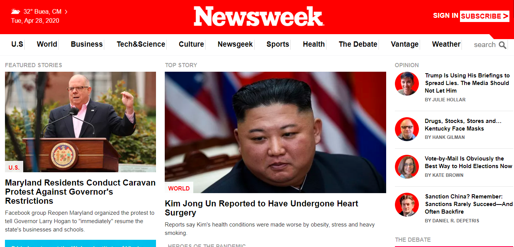

# Apple website webpage clone

> Microverse Project: A replica of the Newsweek magazine 

## Built With

- HTML,
- CSS
- Bootstrap

## Live Demo

[Live Demo Link](https://rawcdn.githack.com/tGodson/Newsweek-Clone/178609c83900719cf40a92d90914622354ea21ad/index.html)

👤 **Author**

- Github: [@tGodson](https://github.com/tGodson)
- Twitter: [@tendongze-godson](https://twitter.com/tendongze-godson)
- Linkedin: [linkedin](https://linkedin.com/in/tendongze95)

## 🤝 Contributing

Contributions, issues and feature requests are welcome!

Feel free to check the [issues page](https://github.com/tGodson/Newsweek-clone/issues).

## Show your support

Give a ⭐️ if you like this project!

## Acknowledgments

- Had a lot of help from  @ebeagusamuel

## 📝 License

This project is [MIT](lic.url) licensed.
